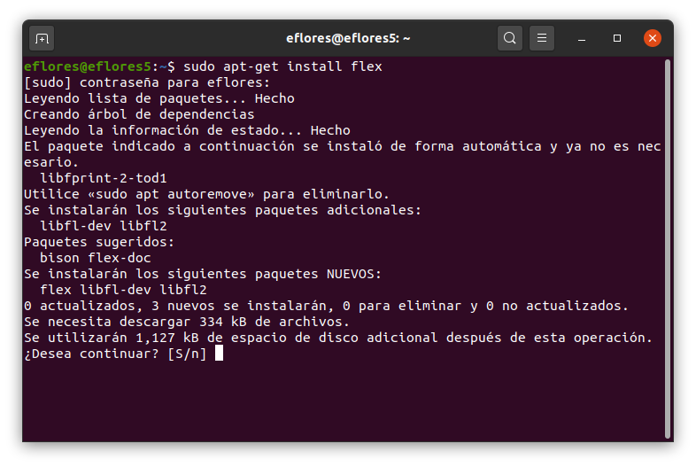
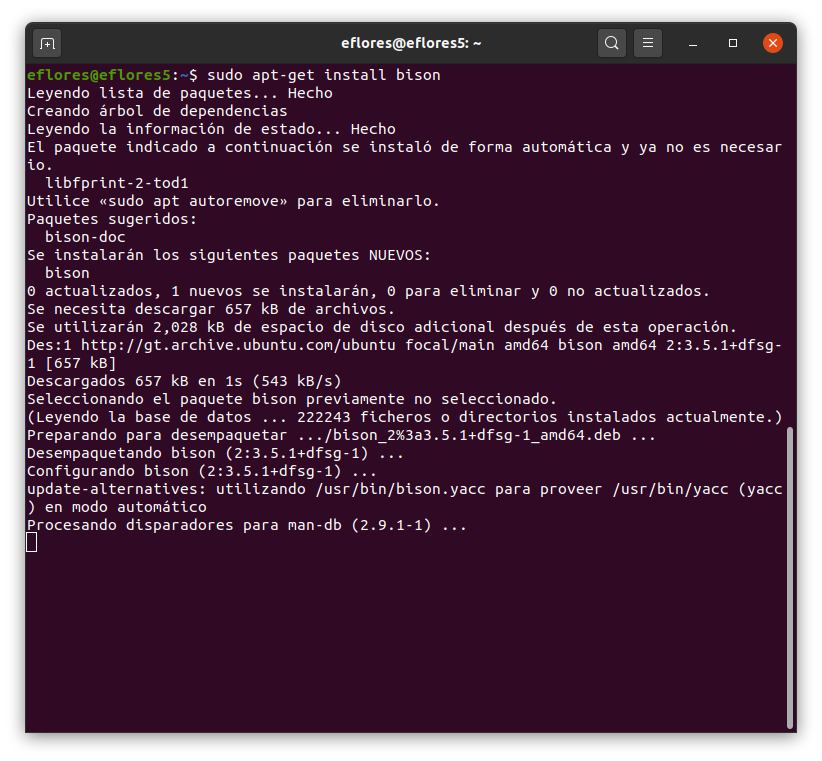
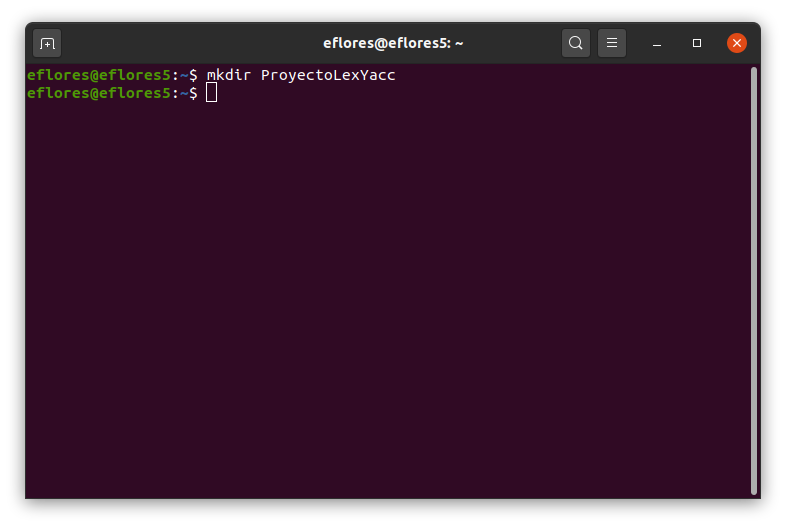
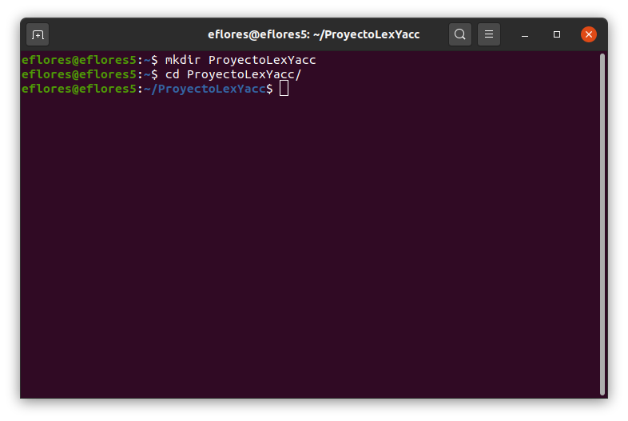
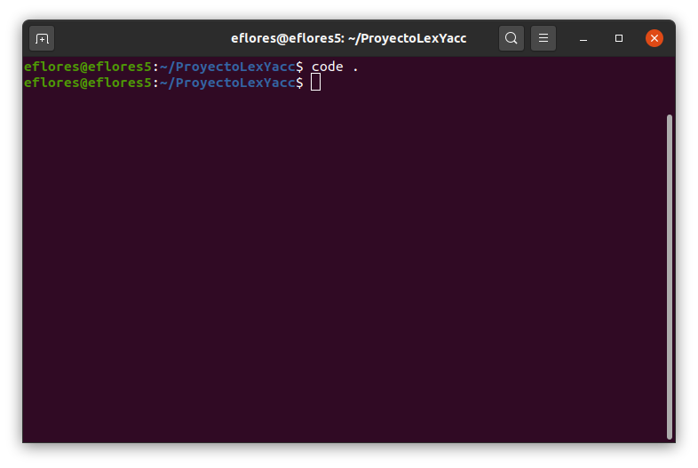
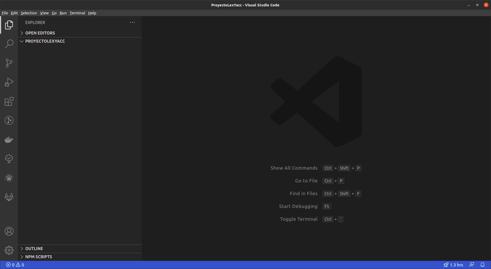
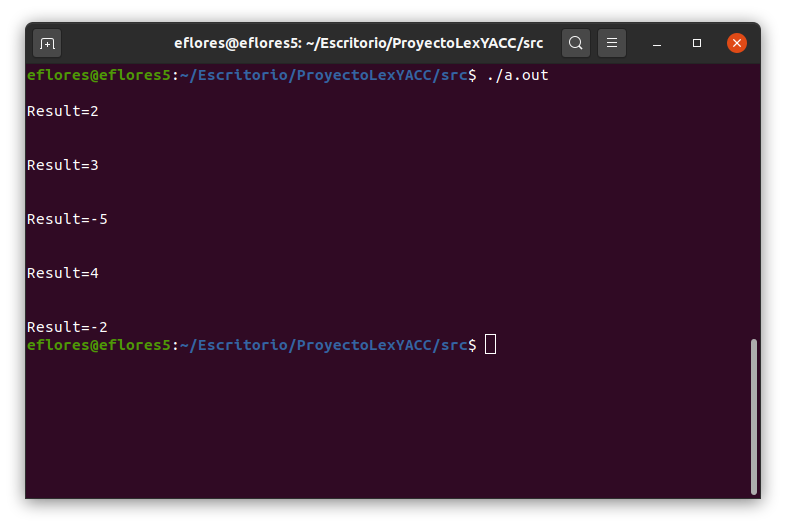

# Mi primer proyecto utilizando Lex y Yacc (Linux)
Se desarrollará un intérprete que recibe como entrada varias expresiones aritméticas y presenta como salida el resultado de dichas expresiones.

Las tecnologías a utilizar son:
* Lex: Generador de analizadores léxicos
* Yacc: Generador de analizadores sintácticos
* Ubuntu 20.04: Sistema operativo
* Visual Studio Code: Editor de código fuente
* C: Lenguaje de programación

El proyecto completo del ejemplo puede descargarse en el siguient enlace:
https://github.com/ericknavarro/ProyectoLexYACC

## Lex
Lex es una herramienta que permite generar analizadore léxicos a partir de un conjunto de reglas y expresiones regulares. Desarrollado por Eric Schmidt y Mike Lesk para los sistemas Unix. Escrito en C para C, su implementación para C++ es posible, aunque no es segura ya que está mas enfocado en el trabajo con C. 
La principal tarea de un analizador léxico es leer los caracteres de entrada del programa fuente, agruparlos en lexemas y producir como salida una secuencia de tokens.

* Un token es un par que consiste en un nombre de token y un valor de atributo opcional.
* Un lexema es una secuencia de caracteres en el programa fuente, que coinciden con el patrón para un token y que el analizador léxico identifica como una instancia de este tóken.
* Un patrón es una descripción de la forma que pueden tomar los lexemas de un token.

La página oficial de Lex se encuentra en el siguient enlace: 
http://dinosaur.compilertools.net/

## Yacc
Yacc es un generador de analizadores sintácticos ascendentes escrito en C para C. Las siglas Yacc significan *Yet Another Compiler-Compiler* que en español significa *Otro generador de compiladores más*. Desarrollado por Stephen C. Jhonson en AT&T para el sistema operativo Unix. 

El analizador sintáctico obtiene una cadena de tokens del analizador léxico y verifica que dicha cadena pueda generase con la gramática para el lenguaje fuente. Una gramática proporciona una especificación precisa y fácil de entender de un lenguaje de programación.

La página oficial de Yacc se encuentra en el siguiente enlace: http://dinosaur.compilertools.net/


## Prerequisitos
Para este ejemplo neceistamos las siguientes herramientas:
* Compilador GCC
* Visual Studio Code (o cualquier editor de texto de nuestro agrado)

## Instalación y configuración de las herramientas
Lo primero que haremos será instalar Lex, para ello abrimos una terminal, en Ubuntu puede hacerse con la combinación de teclas **Ctrl + Alt + t** o en **Aplicaciones → Accesorios → Terminal**, una vez abierta la terminal ingresamos el comando ``sudo apt-get install flex``, autenticamos ingresando nuestra contraseña y aceptamos la descarga e instalación, con esto quedará instalado **Lex**. Como nos pudimos dar cuenta, la instalación de Lex se hace a través Flex que es otra herramienta de analisis léxico. 



Luego instalamos Yacc, ejecutando el comando ``sudo apt-get install bison``, autenticamos ingresando nuestra contraseña y aceptamos la descarga e instalación, con esto quedará instalado **Yacc**. Como nos pudimos dar cuenta, la instalación de Yacc se hace a través de Bison que es otra herramienta de análisis sintáctico.



## Crear nuestro proyecto
Creamos un nuevo folder el cual será nuestro espacio de trabajo, para crearlo abrimos una terminal y ejecutamos el comando ``mkdir ProyectoLexYacc``. Luego ingresamos a nuestro folder con el comando ``cd ProyectoLexYacc``.




Ahora nos pasamos a el editor de código, en este caso usaremos Visual Studio Code. Para abrir nuestro directorio de trabajo en Visual Studio Code ejecutamos desde la terminal el comando ``code . `` el punto al final es importante, ya que le indica a Visual Studio Code que abra una nueva ventana en el directorio actual.



Esto desplegará una ventana de Visual Studio Code, con nuestro proyecto llamado **ProyectoLexYacc**.



Definimos la estructura de nuestro espacio de trabajo creando un directorio llamado ``src`` en donde estará todo nuestro código fuente. Sobre el diectorio ``src`` creamos un directorio ``analizador``, en este directorio estará todo el código relacionado con Yacc y Lex.

### Código fuente para el analizador léxico
En el archivo ``lexer.l`` incluiremos todo el código que le indicará a Lex lo que debe de hacer. El código se muestra a continuación:
```c
%{ 
  #include<stdio.h> 
  #include "y.tab.h" 
  void yyerror(char *);
%} 

%option noyywrap
  
DIGIT   [0-9]
NUM     {DIGIT}+("."{DIGIT}+)?

/* Rule Section */
%% 
{NUM}               { yylval=atoi(yytext); return NUMBER; } 
[-()+*/;]            { return *yytext; }
"evaluar"            { return EVALUAR; }
[[:blank:]] ;
.                     yyerror("Unknown character");
%% 
```

### Explicación código fuente para el analizador léxico
En las primeras lineas incluimos el ficherio ``stdio.h`` para la lectura de archivos, luego incluimos la cabecera ``y.tab.h`` que es el archivo que genera Yacc para nuestro analizador sintáctico. Por último declaramos la función ``yyerror``, función propia de Yacc para el manejo de errores léxicos.
```c
%{ 
  #include<stdio.h> 
  #include "y.tab.h" 
  void yyerror(char *);
%} 
```

Establecemos una lista de directivas propias de Lex:
* La directiva **noyywrap** le indica a Lex que unicamente leera un archivo de entrada.

```c  
%option noyywrap
```

Luego se escriben algunas expresiones regulares para identificar enteros y decimales.
```c++
DIGIT   [0-9]
NUM     {DIGIT}+("."{DIGIT}+)?
```

En esta sección definimos todas las reglas léxicas, en las que indicamos patrones que reconocerá y dentro de llaves lo que debe hacer cuando los reconozca. Para retornar nuestras reglas como tokens y que puedan ser utilizadas en el analizador sintáctico retornamos un id que le asignaremos a cada token, para los tokens de tipo símbolo retornamos la variable yytext, para tener un analizador mas limpio. En el caso de **NUM** adicional al token debemos regresar el valor numérico reconocido, por lo que es necesario hacer una conversión con la función **atoi** que convierte una cadena a un número y lo almacenamos en yyval. Para los espacios en blanco, Lex cuenta con una directiva **[[:blank]]** donde podemos ver que no retornamos ningún simbolo, ya que ignoramos los espacios en blanco. Luego indicamos con un punto que todo lo que no fue reconocido en las reglas anteriores será un error léxico. 

```c++
/* Rule Section */
%% 
{NUM}               { yylval=atoi(yytext); return NUMBER; } 
[-()+*/;]            { return *yytext; }
"evaluar"            { return EVALUAR; }
[[:blank:]] ;
.                     yyerror("Unknown character");
%% 
```

### Código fuente para el analizador sintáctico
En el archivo ``parser.y`` incluiremos todo el código que le indicará a Yacc lo que debe de hacer. El código se muestra a continuación:
```c
%{ 
   #include<stdio.h> 
   int yylex(void);
   void yyerror(char *s);
   FILE *yyin;
%} 
  
%token NUMBER EVALUAR
  
%left '+' '-'
%left '*' '/'
%left NEG

  
/* Rule Section */
%% 
  
Init 
   : Lista {
      return 0;
   }
;

Lista 
   : Lista EVALUAR '(' Expr ')' ';'
   {
      printf("\nResult=%d\n", $4);
   }
   | EVALUAR '(' Expr ')' ';'
   { 
      printf("\nResult=%d\n", $3); 
   }
;

Expr 
   : Expr '+' Expr 
   {
      $$ = $1 + $3; 
   } 
   | Expr '-' Expr 
   {
      $$ = $1 - $3;
   } 
   | Expr '*' Expr 
   {
      $$ = $1 * $3;
   } 
   | Expr '/' Expr 
   {
      $$ = $1/$3;
   }
   | '-' Expr %prec NEG {
      $$ = -$2;
   } 
   |'(' Expr ')' 
   {
      $$ = $2;
   } 
   | NUMBER 
   {
      $$ = $1;
   } 
; 
  
%% 
  
//driver code 
void parse(FILE *file) { 
   yyin = file;
   yyparse();
   fclose(yyin);
} 
  
void yyerror(char *s) { 
   printf("\n%s\n", s); 
}
```

### Explicación código fuente para el analizador sintáctico
En las primeras lineas incluimos el ficherio ``stdio.h`` para la lectura de archivos, luego declarramos la función **yylex**, que es la encargada del analizador léxico, también declaramos la función **yyerror**, que utiliza Yacc para el manejo de errores sintácticos. Por último declaramos una variable de tipo FILE llamada **yyin**, en esta indicaremos el archivo de entrada que será analizado.
```c
%{ 
   #include<stdio.h> 
   int yylex(void);
   void yyerror(char *s);
   FILE *yyin;
%} 
```

Luego se definen los no terminales, a estos se les puede indicar o no un tipo, por defecto es de tipo int. Los terminales que son símbolos y no retornan ningún identificador asociado al token en el analizador léxico no se agregan en esta sección.

```c++
/******* TERMINALES ********/
%token NUMBER EVALUAR
```

Posteriormente podemos indicar la precedencia de operadores, ya que la gramática escrita es ambigua, es necesario definir una precedencia para que el analizador no entre en conflicto. El nivel de precendencia se define del mas bajo al mas alto. La precendencia mas baja la tienen la suma y la resta, seguido por la multiplicación y división y por último tenemos el signo menos de las expresiones negativas.

```c
%left '+' '-'
%left '*' '/'
%left NEG
```

A continuación tenemos el conjunto de reglas de escritura de la gramática o producciones. Escribimos nuestras producciones, para asignar reglas de producción lo hacemos mediante llaves "{ }", en esta sección podemos escribir código de C. Ya que los analizadores que utiliza Yacc son ascenentes, nos permiten sintetizar atributos, para sintentizar un atributo lo hacemos a traves del identificador "$$".


```c
%%
Init 
   : Lista {
      return 0;
   }
;

Lista 
   : Lista EVALUAR '(' Expr ')' ';'
   {
      printf("\nResult=%d\n", $4);
   }
   | EVALUAR '(' Expr ')' ';'
   { 
      printf("\nResult=%d\n", $3); 
   }
;

Expr 
   : Expr '+' Expr 
   {
      $$ = $1 + $3; 
   } 
   | Expr '-' Expr 
   {
      $$ = $1 - $3;
   } 
   | Expr '*' Expr 
   {
      $$ = $1 * $3;
   } 
   | Expr '/' Expr 
   {
      $$ = $1/$3;
   }
   | '-' Expr %prec NEG {
      $$ = -$2;
   } 
   |'(' Expr ')' 
   {
      $$ = $2;
   } 
   | NUMBER 
   {
      $$ = $1;
   } 
;  
%%
```

Como último paso, definimos la función que será llamada para inciar el análisis sintáctico, que en este caso es la función **parse**, esta recibe como parámetro un FILE, que será nuestro archivo de entrada a ser analizado. Por último definimos la función **yyerror**, la cúal será llamada si existiera un error sintáctico, esta función es propia de Yacc.

```c++
void parse(FILE *file) { 
   yyin = file;
   yyparse();
   fclose(yyin);
} 
  
void yyerror(char *s) { 
   printf("\n%s\n", s); 
}
```

### El archivo de compilación
En el archivo **compilar.sh**, ejecutamos dos lineas, la primera indica a Lex que debe generar un analizador léxico en base al código fuente que se encuentra en el archivo Léxico. La segunda linea le indica a Yacc que genere los archivos de compilación para el analizador sintáctico en base al archvio Parser.

```sh
lex lexer.l
yacc parser.y -d
```

Para ejecutar abrimos una terminal sobre el directorio ``analizador`` y ejecutamos lo siguiente:
```sh
./compilar.sh
```

**Nota:** Si el comando genera error, asegurese de que el archivo tenga permisos de ejecución.

Este comando genera una serie de archivos que se han mencionado ya anteriormente. Los archivos que genera son los siguientes:
* y.tab.c
* y.tab.h
* lex.yy.c

### Archivo de entrada
Dentro de la carpeta src del proyecto, creamos un archivo de entrada llamado **entrada.txt**, que contendrá el archivo de enetrada que reconocerán nuestros analizadores.

El archivo contiene lo siguiente:

```txt
evaluar(1+1);
evaluar(1+1*2);
evaluar(-(1+1*6/3-5+7));
evaluar(-(1+1*6/3-5+1*-2));
evaluar(-(1+1));
```

### Archivo Principal
Dentro del archivo principal definimos el método *main*, en este creamos un objeto Driver y ejecutamos su método parse, como parámetro le pasamos el nombre del archivo que vamos a analizar.
Dentro del archivo principal, declaramos el método *parse*, el cúal fue definido en el analizador sintáctico. Definimos nuestro método *main*, en este creamos abrimos un archivo a través de FILE, indicamos la ruta del archivo de entrada y por último llamamos a nuestro método parse y le pasamos como parámetro el archivo de entrada. 

```c
#include <stdio.h> 
#include "analizador/y.tab.h"
void parse(FILE *file);

void main(){
    FILE *file = fopen("entrada.txt", "r");
    parse(file);   
}
```

### Ejecutando nuestra aplicación
Para ejecutar nuestra aplicación necesitamos compilar todos los archivos y generar el ejecutable. Esto lo realizamos con el compilador de c++ ejecutando desde consola el siguiente comando:

```sh
gcc main.cc ./analizador/*.c
```
Este nos genera un archivo ``a.out``, este archivo lo ejecutamos desde consola y obtenemos la salida de nuestro proyecto.



## Fuentes Consultadas
Compiladores, principios, técnicas y herramientas. Aho, Lam, Sethi y Ullman. Segunda Edición.